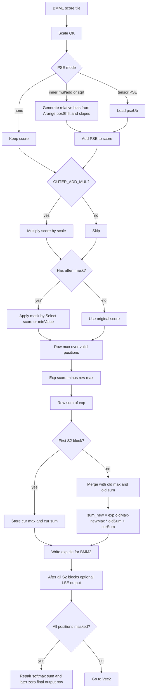

```mermaid
flowchart TD
    A["BMM1 score tile"] --> B["Scale QK"]
    B --> C{"PSE mode"}
    C -->|none| D["Keep score"]
    C -->|inner mul/add or sqrt| E["Generate relative bias from Arange posShift and slopes"]
    C -->|tensor PSE| F["Load pseUb"]
    E --> G["Add PSE to score"]
    F --> G
    D --> H{"OUTER_ADD_MUL?"}
    G --> H
    H -->|yes| I["Multiply score by scale"]
    H -->|no| J["Skip"]
    I --> K{"Has atten mask?"}
    J --> K
    K -->|yes| L["Apply mask by Select score or minValue"]
    K -->|no| M["Use original score"]
    L --> N["Row max over valid positions"]
    M --> N
    N --> O["Exp score minus row max"]
    O --> P["Row sum of exp"]
    P --> Q{"First S2 block?"}
    Q -->|yes| R["Store cur max and cur sum"]
    Q -->|no| S["Merge with old max and old sum"]
    S --> T["sum_new = exp oldMax-newMax * oldSum + curSum"]
    R --> U["Write exp tile for BMM2"]
    T --> U
    U --> V["After all S2 blocks optional LSE output"]
    V --> W{"All positions masked?"}
    W -->|yes| X["Repair softmax sum and later zero final output row"]
    W -->|no| Y["Go to Vec2"]

```