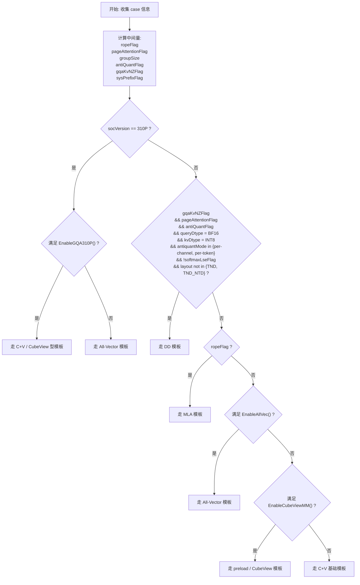

# IFA模板选择决策表

本文整理 IncreFlashAttention（IFA）在不同输入场景下的模板选择规则，并给出可直接用于排查和评审的决策表与流程图。

相关参考：

- [IFA算子设计介绍](./IFA算子设计介绍.md)
- [incre_flash_attention_tiling.cpp](../op_host/incre_flash_attention_tiling.cpp)
- [incre_flash_attention_tiling_check.cpp](../op_host/incre_flash_attention_tiling_check.cpp)
- [incre_flash_attention_arch32.h](../op_kernel/incre_flash_attention_arch32.h)

## 目的

当拿到一个 IFA case 后，通常需要回答两个问题：

1. 该 case 会走哪个大模板。
2. 继续细分时，还需要哪些信息才能判定到具体 tilingKey 实例。

本文先解决第一个问题，即判定大模板。这里的大模板指：

- All-Vector 模板
- C+V 基础模板
- preload / CubeView 模板
- DD 模板
- MLA 模板

## 模板总览

| 大模板 | 主要文件 | 主要特点 |
| --- | --- | --- |
| All-Vector | `attention/incre_flash_attention/op_kernel/incre_flash_attention_allvec_new.h` | matmul 与前后处理都由 Vector 完成，适合简单、规整的纯 FP16 场景 |
| C+V 基础模板 | `attention/incre_flash_attention/op_kernel/arch32/incre_flash_attention_split_Bbn2s2_Us2.h` | 通用主模板，Cube 做 matmul，Vector 做前后处理，覆盖面最广 |
| preload / CubeView | `attention/incre_flash_attention/op_kernel/arch32/incre_flash_attention_preload.h` | 基于 matmul 基础 API，采用更激进的 Cube 视角和更紧凑的流水 |
| DD | `attention/incre_flash_attention/op_kernel/arch32/incre_flash_attention_preload_dd.h` | GQA + KV NZ + antiquant 专项模板 |
| MLA | `attention/incre_flash_attention/op_kernel/arch32/incre_flash_attention_preload_mla.h` | MLA / rope 专项模板 |

## 判定前需要知道的信息

### 基础输入信息

| 字段 | 说明 |
| --- | --- |
| `socVersion` | 芯片代际，如 `310P`、`910B/A2` |
| `layout` | `BSH` / `BSND` / `BNSD` / `TND` / `TND_NTD` |
| `queryDtype` | `FP16` / `BF16` / `INT8` 等 |
| `kvDtype` | `FP16` / `BF16` / `INT8` / `INT4` |
| `outputDtype` | `FP16` / `BF16` / `INT8` |
| `numHeads` | Query 头数 |
| `numKvHeads` | KV 头数 |
| `headDim` | Q/K 的 D 维 |
| `headDimV` | V 的 D 维 |
| `qSeqSize` | Query 序列长度 |
| `maxActualSeq` | KV 最大实际长度 |
| `hasBlockTable` | 是否存在 `blockTable`，即是否为 PageAttention |
| `hasQueryRope` | 是否有 `queryRope` |
| `hasKeyRope` | 是否有 `keyRope` |
| `kDimNum` | Key 张量维度数，普通场景常见为 3 或 4，NZ 常见为 5 |
| `hasSharedPrefix` | 是否有 shared prefix |
| `innerPrecise` | 高性能或高精度 |
| `softmaxLseFlag` | 是否要求输出 `softmaxLse` |
| `antiquantMode` | `per-channel` / `per-token` / `mixed` |

### 派生判断量

这些量通常不直接由用户输入，而是由 host 侧逻辑根据输入计算得到。

| 派生量 | 判定规则 |
| --- | --- |
| `pageAttentionFlag` | `hasBlockTable == true` |
| `ropeFlag` | `hasQueryRope && hasKeyRope` |
| `groupSize` | `numHeads / numKvHeads` |
| `isGQA` | `groupSize > 1` |
| `antiQuantFlag` | `queryDtype != kvDtype && kvDtype in {INT8, INT4}` |
| `quantFlag` | `queryDtype == INT8 && kvDtype == INT8` |
| `gqaKvNZFlag` | `kDimNum == 5 && !ropeFlag` |
| `sysPrefixFlag` | `hasSharedPrefix == true` |

## 大模板决策表

以下决策表按优先级从高到低排列。命中前面的规则后，不再继续往后判断。

| 优先级 | 决策条件 | 命中结果 | 说明 |
| --- | --- | --- | --- |
| 1 | `socVersion != 310P` 且 `gqaKvNZFlag == true` 且 `pageAttentionFlag == true` 且 `antiQuantFlag == true` 且 `queryDtype == BF16` 且 `kvDtype == INT8` 且 `antiquantMode in {per-channel, per-token}` 且 `softmaxLseFlag == false` 且 `layout not in {TND, TND_NTD}` | DD 模板 | GQA + KV NZ + antiquant 专项场景 |
| 2 | `socVersion != 310P` 且 `ropeFlag == true` | MLA 模板 | rope/MLA 场景优先走 MLA |
| 3 | `socVersion == 310P` 且满足 `EnableGQA310P()` | C+V / CubeView 型模板 | 310P 的特殊路径 |
| 4 | 满足 `EnableAllVec()` | All-Vector 模板 | 非 PA、非 prefix、非 GQA、纯 FP16 的简单场景 |
| 5 | 满足 `EnableCubeViewMM()` | preload / CubeView 模板 | 满足 CubeView 约束且收益足够 |
| 6 | 以上都不满足 | C+V 基础模板 | 默认回退路径 |

## 子决策表

### `EnableAllVec()` 决策表

对应代码：`incre_flash_attention_tiling_check.cpp` 中的 `EnableAllVec()`

| 条件项 | 要求 |
| --- | --- |
| `socVersion == 310P` | 直接可走 AllVec 倾向 |
| `pageAttentionFlag` | 必须为 `false` |
| `sysPrefixFlag` | 必须为 `false` |
| `groupSize` | 必须等于 `1` |
| `headDim` | 必须 `<= 512` |
| `queryDtype` | 必须 `FP16` |
| `kvDtype` | 必须 `FP16` |
| `outputDtype` | 必须 `FP16` |

若全部满足，则走 All-Vector 模板。

### `EnableCubeViewMM()` 决策表

对应代码：`incre_flash_attention_tiling_check.cpp` 中的 `EnableCubeViewMM()`

| 条件项 | 要求 |
| --- | --- |
| `sysPrefixFlag` | 必须为 `false` |
| `groupSize` | 必须 `<= 16` |
| `headDim` | 必须 `== 128` |
| `innerPrecise` | 不能是高精度 |
| `kvDtype` | antiquant 场景下不能是 `INT4` |
| `layout = BSH/BSND` 时 | ND2NZ stride 要合法 |
| 收益阈值 | `batchSize * numKvHeads * ceil(maxActualSeq / 2048) > 128` |

若全部满足，则走 preload / CubeView 模板。

### `EnableGQA310P()` 决策表

对应代码：`incre_flash_attention_tiling_check.cpp` 中的 `EnableGQA310P()`

| 条件项 | 要求 |
| --- | --- |
| `IsFlashDecode(...)` | 不能先命中 |
| `groupSize * qSeqSize > 1` | 满足则可走 |
| 或 | `pageAttentionFlag == true` 且 `groupSize * qSeqSize == 1` 且 `seqSize >= 256` 且 `layout = BSH_BSND` |
| 或 | `pageAttentionFlag == false` 且 `groupSize * qSeqSize == 1` 且 `seqSize >= 256` 且 `layout = BNSD` |

若满足，则在 310P 上走 C+V / CubeView 型路径，否则偏向 All-Vector。

## 决策流程图

## 继续细分到具体 tilingKey 时还需要的信息

如果目标不是只判断大模板，而是继续判断到具体 `tilingKey` 实例，则还需要补充以下字段：

| 信息项 | 作用 |
| --- | --- |
| `layoutVal` | 区分 `BNSD / BSH(BSND) / TND` |
| `inputQVal` | Q dtype 编码 |
| `inputKvVal` | KV dtype 编码 |
| `outputVal` | 输出 dtype 编码 |
| `originVal` | 原始 dtype / rope 相关编码 |
| `splitKvVal` | 是否启用 FlashDecode |
| `paVal` | 是否启用 PageAttention |
| `antiquantModeVal` / `antiquantMode_` | antiquant 模式 |
| `kvLayoutVal` | KV layout 编码，尤其 NZ |
| `balanceMode` | 是否启用 balance split core |
| `perfMode_` | 模板大类 |
| `modeVal` | 普通 / sysPrefix / ATB |

这些字段由 `GenTilingKey()` 统一编码，最终用于 kernel 派发。

## 使用建议

在实际分析中，建议按以下顺序排查：

1. 先确认是否为 `310P`。
2. 再判断是否命中 `DD` 专项场景。
3. 再判断是否为 `MLA / rope` 场景。
4. 再判断是否满足 `AllVec`。
5. 再判断是否满足 `CubeView`。
6. 若都不满足，则视为 C+V 基础模板。

这样可以尽量避免在大量局部条件中来回跳转，更符合 host 侧的真实模板选择顺序。
