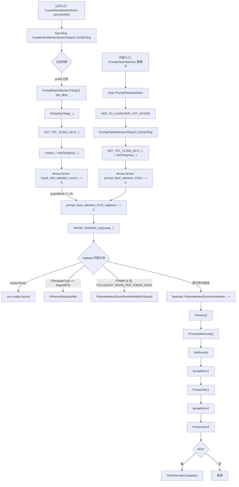

```mermaid
flowchart TD
    A["公共入口: FusedInferAttentionScore (arch35/950)"] --> B["host tiling: FusedInferAttentionScoreTilingV2::DoOpTiling"]
    B --> C{"分支判断"}
    C -->|prefill 分支| D["PromptFlashAttentionTilingV2 pfa_tiling"]
    D --> E["DoSubOpTiling(...)"]
    E --> F["GET_TPL_TILING_KEY(...)"]
    F --> G["context_->SetTilingKey(...)"]
    G --> H["device kernel: fused_infer_attention_score<...>()"]
    H -->|quantMode >= 15| I["prompt_flash_attention_FIAS_regbase<...>()"]

    A2["内部入口: PromptFlashAttention 图算子"] --> B2["l0op::PromptFlashAttention"]
    B2 --> C2["ADD_TO_LAUNCHER_LIST_AICORE"]
    C2 --> D2["PromptFlashAttentionTilingV2::DoOpTiling"]
    D2 --> E2["GET_TPL_TILING_KEY(...) + SetTilingKey(...)"]
    E2 --> F2["device kernel: prompt_flash_attention_FIAS<...>()"]
    F2 --> I

    I --> J["PARSE_PARAMS_NoQuant(...)"]
    J --> K{"regbase 内部分流"}
    K -->|emptyTensor| L["zero output kernel"]
    K -->|dTemplateType == Aligned576| M["FAKernelNoquantMla"]
    K -->|FP8/BF16 且 FULLQUANT_MODE_PER_TOKEN_HEAD| N["FlashAttentionScoreKernelInferMlaFullquant"]
    K -->|其它命中组合| O["BaseApi::FlashAttentionScoreKernelInfer<...>"]
    O --> P["Process()"]
    P --> Q["ProcessMainLoop()"]
    Q --> R["SetRunInfo"]
    R --> S["IterateBmm1"]
    S --> T["ProcessVec1"]
    T --> U["IterateBmm2"]
    U --> V["ProcessVec2"]
    V --> W{"isFd?"}
    W -->|是| X["FlashDecodeCompute()"]
    W -->|否| Y["结束"]

```