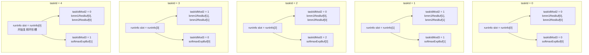

```mermaid
flowchart TB
    subgraph S0["taskId = 0"]
        R0["runInfo slot = runInfo[0]"]
        M00["taskIdMod2 = 0\nbmm1ResBuf[0], bmm2ResBuf[0]"]
        M01["taskIdMod3 = 0\nsoftmaxExpBuf[0]"]
        R0 --> M00
        R0 --> M01
    end

    subgraph S1["taskId = 1"]
        R1["runInfo slot = runInfo[1]"]
        M10["taskIdMod2 = 1\nbmm1ResBuf[1], bmm2ResBuf[1]"]
        M11["taskIdMod3 = 1\nsoftmaxExpBuf[1]"]
        R1 --> M10
        R1 --> M11
    end

    subgraph S2["taskId = 2"]
        R2["runInfo slot = runInfo[2]"]
        M20["taskIdMod2 = 0\nbmm1ResBuf[0], bmm2ResBuf[0]"]
        M21["taskIdMod3 = 2\nsoftmaxExpBuf[2]"]
        R2 --> M20
        R2 --> M21
    end

    subgraph S3["taskId = 3"]
        R3["runInfo slot = runInfo[3]"]
        M30["taskIdMod2 = 1\nbmm1ResBuf[1], bmm2ResBuf[1]"]
        M31["taskIdMod3 = 0\nsoftmaxExpBuf[0]"]
        R3 --> M30
        R3 --> M31
    end

    subgraph S4["taskId = 4"]
        R4["runInfo slot = runInfo[0]\n开始复用环形槽"]
        M40["taskIdMod2 = 0\nbmm1ResBuf[0], bmm2ResBuf[0]"]
        M41["taskIdMod3 = 1\nsoftmaxExpBuf[1]"]
        R4 --> M40
        R4 --> M41
    end

```