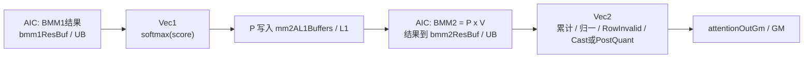

```mermaid
flowchart LR
    A["AIC: BMM1结果\nbmm1ResBuf / UB"] --> B["Vec1\nsoftmax(score)"]
    B --> C["P 写入 mm2AL1Buffers / L1"]
    C --> D["AIC: BMM2 = P x V\n结果到 bmm2ResBuf / UB"]
    D --> E["Vec2\n累计 / 归一 / RowInvalid / Cast或PostQuant"]
    E --> F["attentionOutGm / GM"]

```