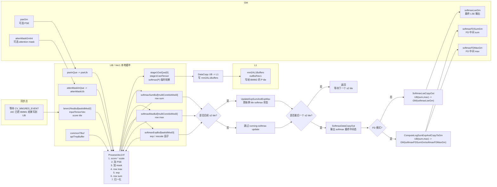

```mermaid
flowchart LR
    subgraph GM["GM"]
        GM_PSE["pseGm\n可选 PSE"]
        GM_MASK["attenMaskGmInt\n可选 attention mask"]
        GM_LSE["softmaxLseGm\n最终 LSE 输出"]
        GM_FD_SUM["softmaxFDSumGm\nFD 中间 sum"]
        GM_FD_MAX["softmaxFDMaxGm\nFD 中间 max"]
    end

    subgraph SYNC["同步点"]
        SYNC1["等待 CV_MM1RES_EVENT\nAIC 已把 BMM1 结果写到 UB"]
    end

    subgraph UB["UB / Vec1 本地缓冲"]
        UB_IN["bmm1ResBuf[taskIdMod2]\ninputTensorVec\nscore tile"]
        UB_PSE["pseInQue -> pseUb"]
        UB_MASK["attenMaskInQue -> attenMaskUb"]
        UB_SUM["softmaxSumBuf[multiCoreIdxMod3]\nrow sum"]
        UB_MAX["softmaxMaxBuf[multiCoreIdxMod3]\nrow max"]
        UB_EXP["softmaxExpBuf[taskIdMod3]\nexp / rescale 因子"]
        UB_TMP["commonTBuf\napiTmpBuffer"]
        UB_STAGE1["stage1OutQue[0]\nstage1CastTensor\nsoftmax(P) 临时结果"]
    end

    subgraph L1["L1"]
        L1_P["mm2AL1Buffers\noutBufVec1\n写给 BMM2 的 P tile"]
    end

    SYNC1 --> UB_IN
    GM_PSE --> UB_PSE
    GM_MASK --> UB_MASK

    UB_IN --> OP1["ProcessVec1Vf\n1. score * scale\n2. 加 PSE\n3. 加 mask\n4. row max\n5. exp\n6. row sum\n7. 归一化"]
    UB_PSE --> OP1
    UB_MASK --> OP1
    UB_SUM --> OP1
    UB_MAX --> OP1
    UB_EXP --> OP1
    UB_TMP --> OP1

    OP1 --> UB_STAGE1
    OP1 --> UB_SUM
    OP1 --> UB_MAX
    OP1 --> UB_EXP

    UB_STAGE1 --> COPY1["DataCopy UB -> L1\n写 mm2AL1Buffers"]
    COPY1 --> L1_P

    UB_SUM --> OP2{"是否后续 s2 tile?"}
    UB_MAX --> OP2
    UB_EXP --> OP2
    OP2 -->|是| OP3["UpdateExpSumAndExpMax\n更新跨 tile softmax 状态"]
    OP2 -->|否| OP4["跳过 running-softmax update"]

    OP3 --> OP5{"是否最后一个 s2 tile?"}
    OP4 --> OP5

    OP5 -->|否| END1["返回\n等待下一个 s2 tile"]
    OP5 -->|是| OP6["SoftmaxDataCopyOut\n输出 softmax 最终中间态"]

    OP6 --> OP7{"FD 模式?"}
    OP7 -->|否| LSE["SoftmaxLseCopyOut\nUB(sum,max) -> GM(softmaxLseGm)"]
    OP7 -->|是| FD1["ComputeLogSumExpAndCopyToGm\nUB(sum,max) -> GM(softmaxFDSumGm/softmaxFDMaxGm)"]

    LSE --> GM_LSE
    FD1 --> GM_FD_SUM
    FD1 --> GM_FD_MAX

```