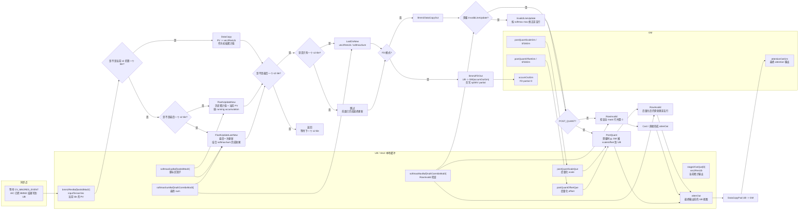

```mermaid
flowchart LR
    subgraph SYNC["同步点"]
        SYNC2["等待 CV_MM2RES_EVENT\nAIC 已把 BMM2 结果写到 UB"]
    end

    subgraph UB["UB / Vec2 本地缓冲"]
        UB_IN2["bmm2ResBuf[taskIdMod2]\ninputTensorVec\n当前 tile 的 PV"]
        UB_VEC2["stage2OutQue[0]\nvec2ResUb\n当前累计输出"]
        UB_EXP2["softmaxExpBuf[taskIdMod3]\n重标定因子"]
        UB_SUM2["softmaxSumBuf[multiCoreIdxMod3]\n最终 sum"]
        UB_MAX2["softmaxMaxBuf[multiCoreIdxMod3]\nRowInvalid 检查"]
        UB_ATTEN["attenOut\n最终输出前的 UB 视图"]
        UB_PQS["postQuantScaleQue\n后量化 scale"]
        UB_PQO["postQuantOffsetQue\n后量化 offset"]
    end

    subgraph GM["GM"]
        GM_OUT["attentionOutGm\n最终 attention 输出"]
        GM_PQS["postQuantScaleGm / bf16Gm"]
        GM_PQO["postQuantOffsetGm / bf16Gm"]
        GM_FD_ACC["accumOutGm\nFD partial O"]
    end

    SYNC2 --> UB_IN2

    UB_IN2 --> DECIDE1{"是不是当前 s2 的第一个 tile?"}
    DECIDE1 -->|是| OP1["DataCopy\nPV -> vec2ResUb\n作为初始累计值"]
    DECIDE1 -->|否| DECIDE2{"是不是最后一个 s2 tile?"}

    DECIDE2 -->|否| OP2["FlashUpdateNew\n历史累计值 + 当前 PV\n做 running accumulation"]
    DECIDE2 -->|是| OP3["FlashUpdateLastNew\n最后一次更新\n结合 softmaxSum 完成收尾"]

    UB_EXP2 --> OP2
    UB_EXP2 --> OP3
    UB_SUM2 --> OP3

    OP1 --> DECIDE3{"是不是最后一个 s2 tile?"}
    OP2 --> DECIDE3
    OP3 --> DECIDE3

    DECIDE3 -->|否| END2["返回\n等待下一个 s2 tile"]
    DECIDE3 -->|是| DECIDE4{"是否只有一个 s2 tile?"}

    DECIDE4 -->|是| OP4["LastDivNew\nvec2ResUb / softmaxSum"]
    DECIDE4 -->|否| OP5["跳过\n前面已完成最终更新"]

    UB_SUM2 --> OP4
    OP4 --> OUTSEL
    OP5 --> OUTSEL

    OUTSEL{"FD 模式?"}
    OUTSEL -->|是| FDOUT["Bmm2FDOut\nUB -> GM(accumOutGm)\n先写 splitKV partial"]
    OUTSEL -->|否| COPYOUT["Bmm2DataCopyOut"]

    FDOUT --> GM_FD_ACC

    COPYOUT --> INV1{"需要 InvalidLineUpdate?"}
    UB_MAX2 --> INV1
    INV1 -->|是| OP6["InvalidLineUpdate\n按 softmax max 修正非法行"]
    INV1 -->|否| DECIDE5{"POST_QUANT?"}

    OP6 --> DECIDE5

    DECIDE5 -->|否| OP7["RowInvalid\n检查全 mask 行并置 0"]
    DECIDE5 -->|是| PQ1["PostQuant\n需要时从 GM 搬 scale/offset 到 UB"]

    UB_MAX2 --> OP7
    GM_PQS --> UB_PQS
    GM_PQO --> UB_PQO
    UB_PQS --> PQ1
    UB_PQO --> PQ1

    PQ1 --> OP8["RowInvalid\n后量化后仍需处理非法行"]
    UB_MAX2 --> OP8

    OP7 --> CAST1["Cast / 直接形成 attenOut"]
    OP8 --> UB_ATTEN
    CAST1 --> UB_ATTEN
    PQ1 --> UB_ATTEN

    UB_ATTEN --> COPYGM["DataCopyPad UB -> GM"]
    COPYGM --> GM_OUT

```