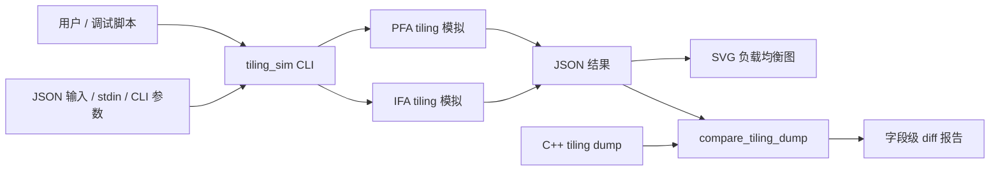
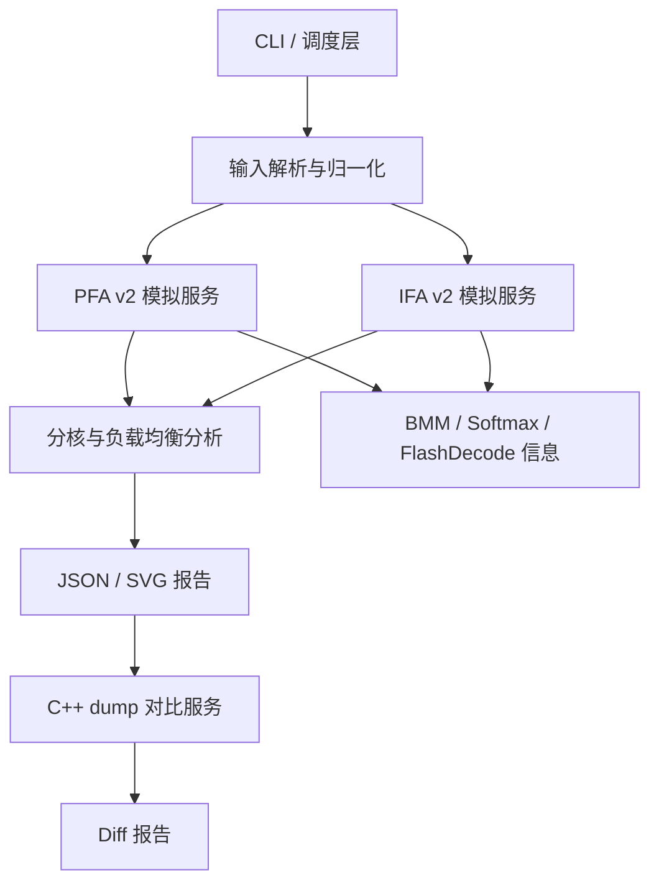
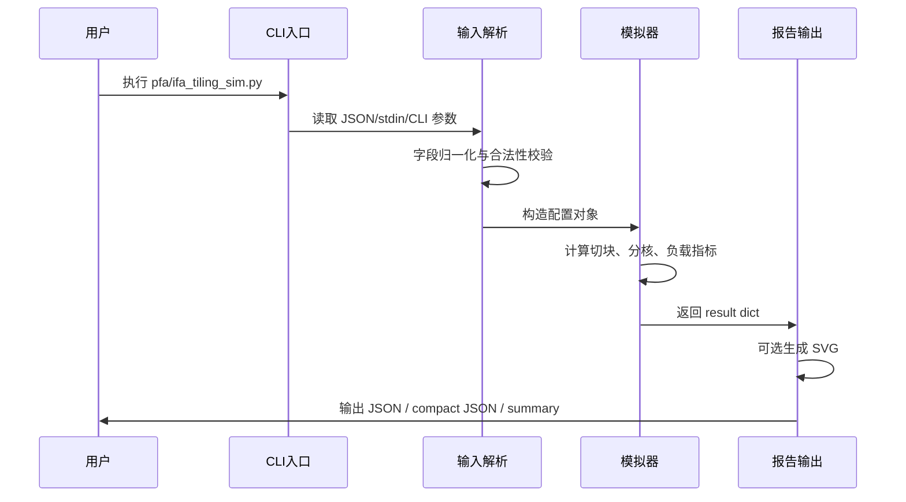
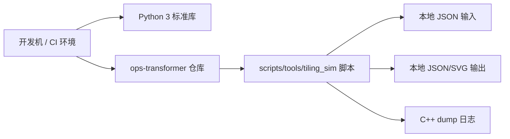

# FA 算子 Tiling 模拟脚本软件设计说明书

## 1. 简介

### 1.1 背景

FA 算子 tiling 模拟脚本 `tiling_sim` 是一组面向 Prompt Flash Attention 和 Incre Flash Attention host 侧 tiling 逻辑的 Python 分析工具，当前实现位于 `scripts/tools` 目录：

- `pfa_tiling_sim.py`：模拟 `attention/prompt_flash_attention/op_host/prompt_flash_attention_tiling_v2.cpp` 中 PFA v2 主路径的切块、BMM check 参数计划和 N-B-S 分核行为。
- `ifa_tiling_sim.py`：模拟 `attention/incre_flash_attention/op_host/incre_flash_attention_tiling_v2.cpp` 中 IFA v2 faRun 主路径的切块、softmax 空间、FlashDecode `splitS2` 和 N-B-S 分核行为。
- `pfa_compare_tiling_dump.py`、`ifa_compare_tiling_dump.py`：将 C++ 侧 dump 日志与 Python 模拟输出进行字段级对比。

该工具用于在不依赖完整 CANN tiling 运行环境的情况下，快速解释 FA 算子 host 侧关键 tiling 决策，辅助问题定位、参数调优、分核负载均衡分析和代码变更回归。

### 1.2 设计目标

- 可读：以 JSON 结构暴露归一化输入、切块结果、分核结果、负载均衡指标和限制说明，便于人工分析。
- 可对照：核心计算逻辑尽量保持与 C++ host tiling 代码同名、同粒度，降低跨语言对照成本。
- 可视化：支持生成每个 candidate cube core 的任务量 SVG 图，直观看出 idle core 和负载倾斜。
- 可校验：支持从 C++ dump 日志中抽取 summary / coreRange，与模拟结果做自动 diff。
- 可扩展：PFA、IFA 和 compare 脚本相互独立，公共概念保持一致，后续可继续补充其他 FA 变体。

### 1.3 非目标

- 不替代真实 CANN `MatmulApiTiling::GetTiling` 或 AscendC 内部 API。
- 不保证 kernel 实际耗时与 task block 权重完全一致。
- 不模拟 device 侧 kernel 计算过程，仅覆盖 host 侧 tiling 决策和可解释输出。

## 2. 第零层设计描述

第零层描述系统在仓库中的边界和外部依赖。



系统输入主要来自四段式 JSON：

- `shape`：B/N/S1/S2/D/DV、Q heads、KV heads 等 shape。
- `attrs`：dtype、layout、sparse mode、actual seq length、prefix 等算子属性。
- `platform`：AIC/AIV 核数、L1/L0C 等平台信息。
- `flags`：PFA/IFA/MLA/PA/mask/PSE/FlashDecode 等路径开关。

系统输出包括：

- 标准 JSON：用于自动化消费和字段对照。
- compact JSON：用于脚本串联或落盘。
- summary 文本：保留 IFA 旧的人类可读输出。
- SVG 图：用于展示 candidate cube core 上的 task block 分布。
- compare diff：用于验证 Python 模拟结果与 C++ dump 的一致性。

## 3. 第一层设计描述

第一层按工具能力拆分为四个子系统。

| 子系统 | 主要文件 | 职责 |
|---|---|---|
| CLI / 调度子系统 | `pfa_tiling_sim.py`、`ifa_tiling_sim.py` | 解析参数、读取 JSON/stdin、生成示例输入、选择输出格式、触发 SVG 输出 |
| PFA 模拟子系统 | `pfa_tiling_sim.py` | PFA v2 切块、DN 调整、BMM1/BMM2 check plan、N-B-S 分核和负载均衡 |
| IFA 模拟子系统 | `ifa_tiling_sim.py` | IFA v2 faRun 切块、softmax 信息、FlashDecode splitS2、N-B-S 分核和负载均衡 |
| 对比与报告子系统 | `*_compare_tiling_dump.py`、`render_load_balance_svg` | C++ dump 对比、JSON 报告、SVG 可视化 |

### 3.1 数据流

1. CLI 层读取输入，若用户使用 `--example`，直接输出示例 JSON 并退出。
2. 输入解析层将四段式 JSON 或 legacy CLI 参数归一化为 dataclass 配置对象。
3. 核心模拟层按源码路径计算切块参数、分核起止信息和负载指标。
4. 报告层输出 JSON；如果指定 `--plot`，额外生成 SVG，并在 JSON 中写入 `visualization.loadBalanceSvg`。
5. 对比脚本读取 C++ dump 和模拟 JSON，按字段映射输出 `OK`、`DIFF` 或 `MISSING`。

### 3.2 核心数据结构

- `PFAConfig`：PFA 输入配置，负责 dtype/layout/GQA 等归一化。
- `IFATilingInput`：IFA 输入配置，负责从四段式 JSON 抽取 shape、attrs、platform、flags。
- `BlockSizes`：IFA `Souter`、`Sinner`、tail、align 等切块结果。
- `SoftmaxInfo`：IFA softmax tmp shape、公式和 regbase UB 布局说明。
- `FlashDecodeInfo`：IFA FlashDecode `splitS2`、workspace 和分裂信息。
- `Diff`：compare 脚本中的单字段对比结果。

### 3.3 4+1 视图

4+1 视图用于从不同关注点描述 `tiling_sim` 的软件架构。其中 4 个基础视图分别覆盖逻辑结构、开发组织、运行过程和部署形态，`+1` 场景视图用于串联典型使用流程。

#### 3.3.1 逻辑视图

逻辑视图关注系统对外提供的能力，以及能力之间的依赖关系。



逻辑上，系统分为输入层、核心模拟层、分析层和报告层：

- 输入层负责将 JSON、stdin 或 CLI 参数转换为标准配置对象。
- 核心模拟层分别实现 PFA v2 和 IFA v2 的 host 侧 tiling 决策。
- 分析层统一计算 task blocks、candidate core、负载均衡指标和 core range。
- 报告层输出 JSON、SVG 或 dump diff。

#### 3.3.2 开发视图

开发视图关注代码组织和维护边界。

```text
scripts/tools/
├── pfa_tiling_sim.py              # PFA v2 模拟主脚本
├── ifa_tiling_sim.py              # IFA v2 模拟主脚本
├── pfa_compare_tiling_dump.py     # PFA C++ dump 对比
├── ifa_compare_tiling_dump.py     # IFA C++ dump 对比
├── pfa_tiling_sim_README.md       # PFA 使用说明
├── ifa_tiling_sim_README.md       # IFA 使用说明
├── pfa_tiling_args_explain.md     # PFA 入参说明
└── tiling_sim_software_design.md  # 软件设计说明书
```

开发边界如下：

- `pfa_tiling_sim.py` 与 `ifa_tiling_sim.py` 以源码可对照性为优先，核心函数不强行合并。
- compare 脚本只承担 dump 解析和字段对比，不承载 tiling 计算逻辑。
- README 和参数说明面向使用者，设计说明书面向维护者和评审者。
- 后续若抽取公共模块，建议只抽取数学工具、负载均衡统计和 SVG 渲染等稳定逻辑。

#### 3.3.3 进程视图

进程视图关注脚本一次执行过程中的控制流和数据流。`tiling_sim` 当前是单进程、同步执行模型，不引入后台服务或并发任务。



该视图下的关键约束：

- 所有计算在本地 Python 进程内完成。
- 输入解析失败、shape 非法或分核数组越界时直接终止当前执行。
- `--plot` 是主结果生成后的附加动作，不影响 JSON 主体计算。

#### 3.3.4 物理视图

物理视图关注工具在实际环境中的部署和依赖。



物理部署特征：

- 脚本随仓库源码交付，无单独安装步骤。
- 运行依赖为 Python 3 标准库，包括 `argparse`、`json`、`dataclasses`、`math`、`re` 等。
- 不依赖 CANN 运行环境，不访问网络，不启动常驻服务。
- 输出文件由用户指定路径落盘，适合在开发机、流水线或问题定位脚本中直接调用。

#### 3.3.5 场景视图

场景视图用典型用例验证上述 4 个视图是否能够闭环。

**场景一：分析一个 PFA case 的切块与分核**

1. 用户通过 `--example` 生成 PFA JSON 模板。
2. 用户修改 shape、attrs、platform 和 flags。
3. `pfa_tiling_sim.py` 读取 JSON 并构造 `PFAConfig`。
4. 脚本计算 `Souter`、`Sinner`、BMM check plan 和 N-B-S 分核。
5. 用户查看 `splitCore.loadBalance`，必要时通过 `--plot` 生成 SVG。

**场景二：分析一个 IFA FlashDecode case**

1. 用户输入 Q/KV heads、actual KV length、head dim 和平台核数。
2. `ifa_tiling_sim.py` 推导 GQA group、`Sinner`、softmax tmp shape。
3. 脚本根据 `force_flash_decode` 或自动判定逻辑计算 `splitS2`。
4. 输出 `flashDecodeSplitS2` 和 `splitCore`，用于判断分裂是否合理。

**场景三：校验 Python 模拟与 C++ dump 是否一致**

1. 用户开启 C++ 侧 tiling dump 并获得日志。
2. 用户用同一 case 运行 `pfa_tiling_sim.py` 或 `ifa_tiling_sim.py` 生成 JSON。
3. compare 脚本解析 dump 中的 summary 和 coreRange。
4. compare 脚本按字段映射生成 diff 报告。
5. 若出现 `DIFF` 或 `MISSING`，开发者回到对应模拟函数或字段映射中修正。

## 4. 第二层设计描述

### 4.1 UI / 调度模块

#### 职责

- 提供统一的命令行访问入口，屏蔽 PFA 与 IFA 模拟流程在参数组织上的差异。
- 支持配置文件输入、标准输入、示例配置生成、紧凑结果输出和可视化结果输出。
- 支持 IFA 单参数快速输入方式，便于开发者快速构造小规模验证样例。
- 负责组织“输入读取、参数归一化、核心模拟、报告生成”的完整执行链路。

#### 功能划分

- 示例配置生成能力：输出可直接运行的 PFA 或 IFA 示例配置，降低首次使用成本。
- 输入装载能力：从本地配置文件或标准输入中读取 JSON，并完成基本格式解析。
- 参数合并能力：将配置文件参数与命令行覆盖参数合并为统一的内部配置。
- 输出编排能力：根据用户选择输出标准 JSON、紧凑 JSON、摘要文本或 SVG 可视化文件。
- 执行调度能力：在输入准备完成后调用对应的 PFA 或 IFA 核心模拟流程。

#### 输入校验

- 当输入为空时，应提示用户先生成示例配置或提供配置文件。
- 当注意力头数、KV 头数等核心张量形状参数非法时，应阻断执行并给出明确错误。
- 当实际序列长度列表的长度不符合批次数量时，应提示期望长度和实际长度。

### 4.2 核心功能模块一：PFA v2 Tiling 模拟

#### 职责

模拟 PFA v2 host 侧关键路径：

- 归一化输入张量形状、数据类型、输入布局和 G/S1 合并行为。
- 计算查询序列外层切块、矩阵计算外层切块、KV 序列内层切块、softmax 外层切块和 KV 序列二次拆分因子。
- 按源码规则执行 DN 相关二次调整。
- 构造第一阶段和第二阶段矩阵计算的检查参数计划。
- 估算按批次、注意力头、序列块维度展开后的多核任务分配结果。

#### 功能划分

- 配置归一化能力：补齐缺省配置，统一数据类型、布局名称、平台核数和实际序列长度。
- 基础切块选择能力：根据输入维度、精度模式、PFA/IFA/MLA/PA 等开关选择初始切块方案。
- DN 调整能力：在满足 DN 路径条件时，对 KV 内层切块等关键参数进行二次修正。
- 矩阵计算检查能力：给出两阶段矩阵计算的输入形状、原始形状和固定切分计划。
- 多核分配能力：按候选 cube 计算核估算任务起止范围、有效任务块数量和实际使用核数。
- 结果汇总能力：将归一化输入、切块结果、分核结果、负载均衡指标和说明信息组装为统一报告。

#### 设计要点

- 实际查询序列长度和实际 KV 序列长度缺省时，按批次数量自动填充默认长度。
- 当 PFA merge、IFA 或 IFA MLA 路径开启时，需模拟源码中的分组归一化行为，即减少有效注意力头维度并扩展查询序列维度。
- 矩阵计算检查输出仅表示 host 侧准备提交给底层 tiling 接口的参数计划，不表示真实平台计算结果。
- 分核权重以有效内层块数量作为估算依据，用于解释 host 侧分核策略，而非预测真实 kernel 耗时。

### 4.3 核心功能模块二：IFA v2 Tiling 模拟

#### 职责

模拟 IFA v2 faRun 主路径：

- 根据查询序列长度、GQA 分组、PSE 开关和注意力头维度选择基础外层/内层切块。
- 计算内层循环次数、尾块大小、对齐大小和用于切分键值的内层切块值。
- 计算 softmax 临时空间形状、AscendC 接口公式和 regbase 路径下的 UB 空间布局。
- 根据稀疏模式、mask、prefix 计算每个批次、注意力头、外层序列行对应的有效内层块数量。
- 判断 FlashDecode 是否启用，并估算 KV 序列二次拆分因子和临时工作空间规模。
- 生成 regbase 多核参数、核间任务范围和逐行任务归属关系。

#### 功能划分

- 配置解析能力：从统一 JSON 或快速命令行参数中提取批次、注意力头数、序列长度、平台核数和路径开关。
- 分组推导能力：根据查询头数与 KV 头数推导 GQA 分组规模，并确定是否按 GQA 路径处理。
- 基础切块能力：按 faRun 主路径规则选择查询序列外层切块和 KV 序列内层切块。
- softmax 空间估算能力：输出临时空间形状、对齐粒度、公式说明和固定 UB 布局。
- 有效任务块计算能力：在 mask、prefix、稀疏模式影响下计算每个任务行实际需要处理的内层块数量。
- FlashDecode 拆分能力：按自动判定或用户强制策略确定是否启用，并估算拆分后的临时工作空间。
- 多核分配能力：按批次、注意力头、序列块维度将任务分配到候选计算核。

#### 设计要点

- 分组规模由查询头数与 KV 头数的比例决定；如果用户没有显式指定 GQA 模式，则由该比例自动推导。
- KV 序列长度未显式给出时，从实际 KV 序列长度列表中推导可用最大值。
- FlashDecode 控制支持强制开启、强制关闭和自动判定三种模式；自动模式应保持与源码判定逻辑一致。
- softmax 临时空间大小只输出可解释公式，因为真实空间申请结果由 AscendC 内部实现决定。

### 4.4 核心功能模块三：Dump 对比与一致性校验

#### 职责

对比 C++ dump 和 Python 模拟输出，帮助确认模拟逻辑是否贴近 host 侧实现。

#### 输入输出

- 输入一：C++ dump 日志，包含汇总信息和各核任务范围信息。
- 输入二：模拟脚本输出的 JSON 文件。
- 输出：字段级差异报告，包含字段路径、C++ 值、Python 值、状态和差异说明。

#### 功能划分

- 日志解析能力：从 C++ 日志中提取汇总信息、各核任务范围和任务量字段。
- 键值解析能力：支持普通键值字段和区间类字段的统一解析。
- 汇总字段对比能力：比较切块、核数、总任务量、均衡目标等关键摘要信息。
- 核范围对比能力：逐核比较批次、注意力头、序列块起止位置和对应任务量。
- 任务数组对比能力：比较实际使用核任务量和候选核任务量，并对空闲候选核补齐零任务量。
- 报告聚合能力：生成包含通过、差异和缺失字段的对比报告。

#### 设计要点

- 浮点字段对比应支持可配置容忍度，避免因小数精度造成误报。
- 字段映射显式写在脚本中，新增 dump 字段时需要同步补充映射。
- 候选核任务量需要包含空闲核，空闲核任务量按 0 处理，以便与 SVG 和负载均衡分析一致。

### 4.5 报告 / 输出模块

#### JSON 输出

核心内容包括：

- 归一化输入信息：展示经过默认值补齐和路径归一化后的实际计算输入。
- 切块结果信息：展示查询序列、KV 序列、softmax 和二次拆分相关的核心切分结果。
- softmax 空间信息：展示 IFA 路径下的临时空间形状、对齐要求和公式说明。
- 批次循环信息：展示每个批次在实际序列长度、mask 和 prefix 影响下的循环规模。
- 分核结果信息：展示使用核数、候选核数、任务权重、核任务范围和负载均衡结果。
- FlashDecode 信息：展示 IFA 路径下的拆分因子、每份 KV 长度和临时工作空间估算。
- 说明信息：展示当前模拟边界、估算口径和与真实 CANN API 的差异。

#### SVG 输出

SVG 可视化根据候选核任务量生成柱状图：

- 横轴表示 cube 计算核编号。
- 一个 cube 计算核对应两个 AIV 计算核。
- 柱高表示该核承载的有效任务块数量。
- 空闲候选核以灰色零任务柱显示。
- 红色虚线表示候选核平均任务量，蓝色虚线表示目标任务量。
- 柱颜色按相对平均任务量的比例区分负载程度。

#### 负载均衡指标

负载均衡报告包含如下指标：

- 实际使用的 cube 计算核数量。
- 候选 cube 计算核总数量。
- 空闲候选 cube 计算核数量。
- 总有效任务块数量。
- 候选核平均任务块数量。
- 分核算法期望的目标任务块数量。
- 单核最大任务块数量及对应核编号。
- 单核最小任务块数量及对应核编号。
- 任务量标准差和变异系数。
- 最大任务量与平均任务量的比值。
- 最小任务量与平均任务量的比值。
- 负载均衡评级。
- 面向人工分析的解释文本。

## 5. 非功能需求

### 5.1 正确性

- 核心公式、分支命名和变量语义应优先与 C++ host tiling 代码保持一致。
- 每次修改核心模拟逻辑后，应使用对应 compare 脚本和典型 case 校验 summary、coreRange、task block 数组。
- 对真实 CANN API 无法复现的部分，输出必须明确标注为计划、公式或估算值。

### 5.2 可维护性

- PFA 与 IFA 的模拟逻辑保持独立，避免为了复用而打乱与源码的对照关系。
- 新增路径时优先补充 dataclass 字段、`example_input()` 和 README 字段说明。
- dump 字段变更时同步更新 compare 脚本的字段映射。
- README 中的命令名称应与实际文件名保持一致。

### 5.3 可用性

- 默认输出缩进 JSON，便于直接阅读。
- `--compact` 输出适合脚本管道和 CI 落盘。
- `--example` 应始终生成可直接运行的最小可用 case。
- 错误信息应包含字段名和期望长度，减少排查成本。

### 5.4 性能

- 单个 case 模拟应为轻量级 CPU 计算，不依赖外部服务。
- 分核遍历复杂度主要与 batch、head、outer loop 和 candidate core 数相关，应避免引入大规模中间矩阵。
- SVG 渲染使用字符串拼接生成静态文件，避免引入额外绘图库依赖。

### 5.5 兼容性

- 使用 Python 3 标准库实现，避免新增第三方依赖。
- JSON 输入保持四段式结构，同时 IFA 保留 legacy CLI 参数输入。
- 输出字段新增时尽量向后兼容，不随意重命名既有字段。

### 5.6 安全性

- 输入文件只按 JSON 解析，不执行用户输入。
- SVG 输出路径由用户显式指定，脚本仅创建目标目录并写入静态 SVG。
- compare 脚本读取 dump 时使用文本解析，不执行日志内容。

## 6. 开发记录

### 6.1 当前实现状态

- 已实现 PFA v2 主路径模拟：基础切块、DN 调整、BMM check plan、N-B-S 分核、负载均衡 JSON 和 SVG。
- 已实现 IFA v2 faRun 主路径模拟：基础切块、softmax 信息、mask/prefix 有效 block 计算、FlashDecode `splitS2`、N-B-S 分核、负载均衡 JSON 和 SVG。
- 已实现 PFA / IFA dump compare 脚本，用于 C++ dump 与 Python 结果的字段级对比。
- 已提供 PFA / IFA README、PFA 参数说明、示例 JSON 和示例 SVG。

### 6.2 已知限制

- PFA BMM check plan 不调用 `MatmulApiTiling::GetTiling`，不能代表真实平台 tiling 成败。
- IFA softmax tmp size 输出源码 API 公式，不计算 AscendC 内部真实返回值。
- task blocks 是 host 侧分核估算权重，不等价于实际 kernel 耗时。
- 当前主要覆盖 PFA v2 和 IFA v2 faRun 主路径，非主路径需要按源码继续补齐。

### 6.3 后续演进建议

- 统一 README 中 IFA 脚本名称，当前实现文件为 `ifa_tiling_sim.py`。
- 抽取 PFA / IFA 共用的 `ceil_div`、`align_up`、load balance 和 SVG 渲染逻辑，形成轻量公共模块。
- 为典型 case 增加自动化回归：示例输入、mask case、GQA case、prefix case、FlashDecode case、DN case。
- 在 compare 报告中增加 summary 统计，例如 OK/DIFF/MISSING 数量和失败字段列表。
- 增加 `--schema` 或字段说明输出，便于调用方自动生成配置。
